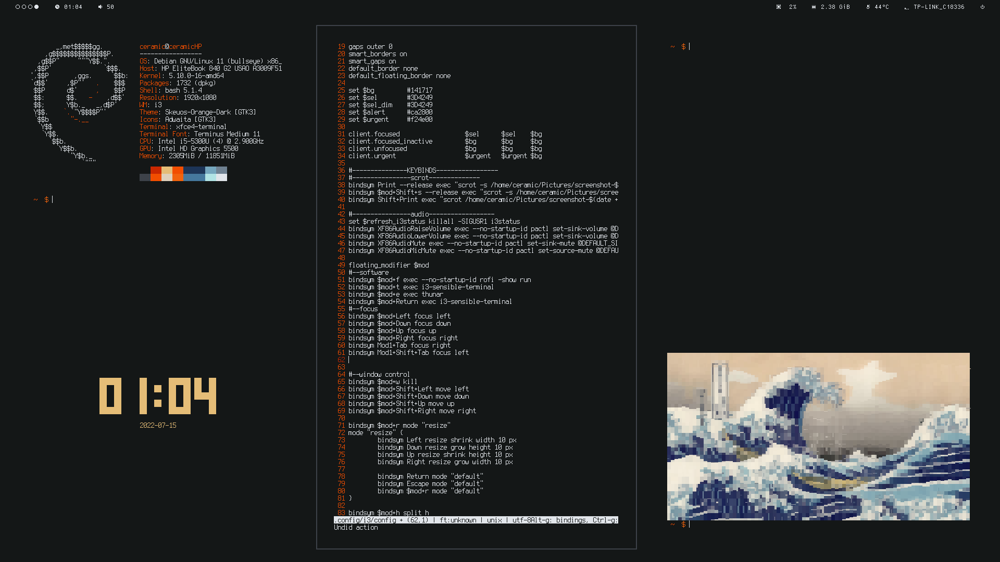

# dotfiles 

My debian configuration

### On screenshot you can see: 

| category              | software |
| :--------------------- |--------------:|
| login manager         | [ly](https://github.com/fairyglade/ly)     |
| bar                   | polybar     |
| terminal              | xfce4-terminal     |
| image viewer          | [tiv](https://github.com/stefanhaustein/TerminalImageViewer)           |
| file manager          | ranger     |
| editor                | [micro](https://github.com/zyedidia/micro)     |